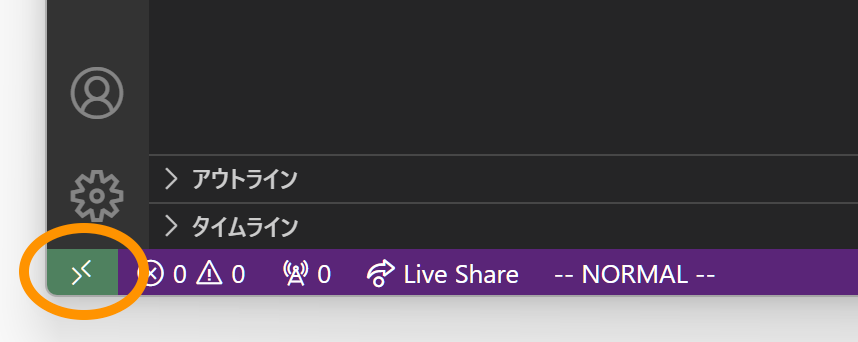
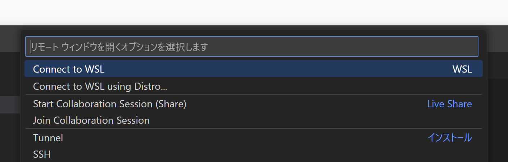
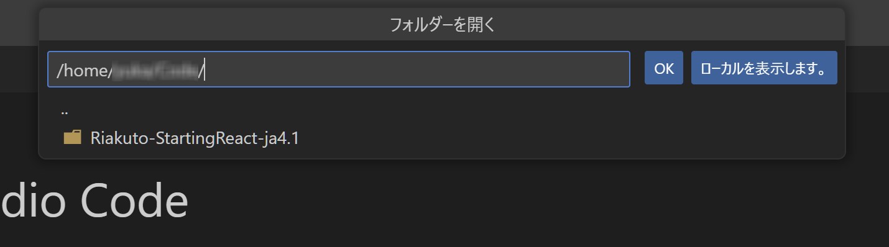

# Windows でフロントエンドの開発環境を作る手順

Windows のネイティブ環境に Node.js を直接インストールするのではなく、[WSL](https://learn.microsoft.com/ja-jp/windows/wsl/about)（<u>W</u>indows <u>S</u>ubsystem for <u>L</u>inux）で Ubuntu を入れて、そこに必要な環境を構築していきます。その際、以下のソフトウェアを併せてインストールします。

- **WinGet**（Windows 標準パッケージマネージャ）
- **Windows Terminal**（ターミナル）
- **asdf**（ランタイムのバージョンマネージャ）
- **Visual Studio Code**（開発用エディタ）

OS 環境としては、Windows 11 および Windows 10 の 2020 年 5 月以降のアップデートを適用したバージョンを対象としています。Windows 10 をお使いの方は、最新の Windows Update を適用しておいてください。

<br />

## 1. WinGet が使えるかを確認

Microsoft が提供する、アプリケーションパッケージのコマンドライン管理ツール。本編における macOS 環境で使用している [Homebrew](https://brew.sh/ja/) と同じような機能を持つ。Windows 11 からは OS の標準パッケージマネージャとしてプリインストールされています。

1. 自身の環境で使えるようになっているかどうかは、コマンドプロンプトまたは Windows Powershell から `winget↵` を実行することで確認できます
2. コマンドが見つからなかった場合、Microsoft Store の「[アプリ インストーラー](https://apps.microsoft.com/detail/9nblggh4nns1?activetab=pivot%3Aoverviewtab&hl=ja-jp&gl=JP)」のページからインストールします

## 2. Ubuntu のインストールと設定

_（参考：「[WSL を使用して Windows に Linux をインストールする方法 | Microsoft Learn](https://learn.microsoft.com/ja-jp/windows/wsl/install)」）_

1. コマンドプロンプトを「管理者として実行」で開き、以下のコマンドを実行する

```powershell
> wsl --install
```

2. インストールが成功すると Ubuntu が起動、そこで `Enter new UNIX username:` と入力を促されるので好きユーザー名を、`New password:` には任意のパスワードを設定する

<br />

## 3. Windows Terminal のインストール

コマンドラインから `npm` や `git` などを実行する場合、ターミナルとして最初から用意されているコマンドプロンプトや Powershell を直接使うのではなく Windows Terminal を別途インストールして使うことをおすすめします。理由としては以下のとおり。

- 複数のタブとペイン
  …… 同時に複数のターミナルを開いて作業できるため、コンパイル、サーバ起動、デバッグなど、複数のタスクを効率的に管理できる
- 高いカスタマイズ性
  …… テーマやフォント、キーバインドなど、開発者の好みに合わせて細かくカスタマイズ可能
- 機能的なコマンド履歴
  …… 使いやすい検索機能とフィルタリングにより、以前実行したコマンドを素早く見つけられる
- 包括的な Unicode 対応および絵文字サポート
- モダンで見やすい UI

以下は Windows Terminal のインストールの手順。

1. 管理者として開いたコマンドプロンプトから、次のコマンドを実行する  
   （※ `winget` コマンドが実行できない場合、Microsoft Store を一度開いてからやり直す）

```powershell
> winget install Microsoft.WindowsTerminal
```

2. インストールした Windows Terminal を起動、タブの右横にある「⌄」を押して開いたプルダウンから「⚙ 設定」を選択。「スタートアップ」の「規定のプロファイル」を「Ubuntu」にして保存する

<br />

## 4. asdf のインストール

_（参考：「[はじめよう | asdf](https://asdf-vm.com/ja-jp/guide/getting-started.html)」）_

1. Windows Terminal の Ubuntu プロファイルで開いたタブウィンドウから、以下のコマンドを実行して APT のパッケージ情報およびインストール済みのパッケージを最新にする

```shell
$ sudo apt update
$ sudo apt -y upgrade
```

2. Git コマンドで最新版の asdf のリポジトリをダウンロードする。現在の最新のバージョンがいくつかは[リリースページ](https://github.com/asdf-vm/asdf/tags)で確認できる

```shell
$ git clone https://github.com/asdf-vm/asdf.git ~/.asdf --branch v0.14.1
```

3. インストーラを実行する

```shell
$ . "$HOME/.asdf/asdf.sh"
$ . "$HOME/.asdf/completions/asdf.bash"
```

4. シェルを再起動する

```shell
$ exec $SHELL -l
```

<br />

## 5. Node.js のインストール

- 本書「1-1-2. Node.js をインストールする」の 23 ページ以降の内容にしたがって、asdf を使って Node.js 環境を構築する

<br />

## 6. Visual Studio Code のインストールと設定

_（参考：「[Windows Subsystem for Linux で VS Code の使用を開始する](https://learn.microsoft.com/ja-jp/windows/wsl/tutorials/wsl-VSCode)」）_

1. [公式サイトのダウンロードページ](https://code.visualstudio.com/download)から、 Visual Studio Code の Windows 用インストーラをダウンロードして実行する

2. Visual Studio Code を起動し、左のアクティビティバーの「👤 Accounts」アイコンをクリック、 「Sign in to Sync Settings」`File > Prefenrence > Setting Sync` から GitHub アカウントまたは Microsoft アカウントでログインして設定の同期を有効にする

3. VS Code で [WSL](https://marketplace.visualstudio.com/items?itemName=ms-VSCode-remote.remote-wsl) および [Japanese Language Pack for Visual Studio Code](https://marketplace.visualstudio.com/items?itemName=MS-CEINTL.vscode-language-pack-ja) の拡張をインストール。いったん VS Code を終了する

4. Windows Terminal を開き、必要なパッケージをインストールして SSL 接続ができるようにしておく

```shell
$ sudo apt install ca-certificates
```

5. 適当なプロジェクトをローカルに用意する

```shell
$ git clone https://github.com/klemiwary/Riakuto-StartingReact-ja4.0.git
```

6. VS Code を起動し直す。左下隅に「リモートウィンドウを開きます」のアイコンが表示されているはずなのでそれをクリック

<div align="center">

</div>

7. コマンドパレットに WSL で開くオプションメニューが表示されるので、「Remote-WSL: Open Folder in WSL...」を選択する

<div align="center">

</div>

8. 「ようこそ」タブペインに「WSL の使用を開始する」が表示されるので、一覧から「プロジェクトがありますか？ WSL で開きます」を選択

9. 「フォルダーを開く」が表示されるので、5 で用意したプロジェクトの中から任意のフォルダーを選択して開く

<div align="center">

</div>

- VS Code 拡張には、WSL 上で動作させるために WSL 側の環境にもインストールの必要があるものが多い。ローカルにインストール済みでかつ WSL 側にもインストールする必要のあるものは「WSL: Ubuntu 二インストールする️」というボタンが表示されるので、それをクリックしてインストールしておく

<div align="center">

</div>
